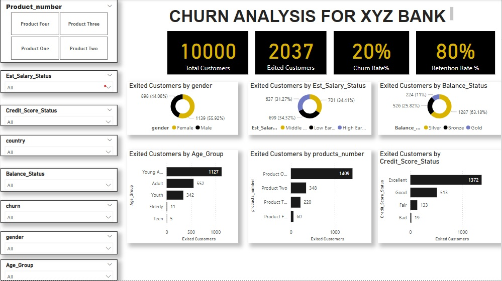

# Churn_Report XYZ Bank
The report shows the customer churn for 10000 customers of XYZ Bank showing overall rate of 20%

## Visualization

## KEY FINDINGS:

Gender Distribution :  The gender distribution chart clearly shows that females of the bank are exhibiting more churn rate which stands at 1139 than the Males which stands at 898.

Estimate Salary Status:  The estimated salary status chart shows that Middle earns have the highest churn which stands at 701 followed by Low earners which stands at 699 while High earners are the least on churn rating at 637.

Age Group: The young adults dominates the churn(1127) while the teens are the least with just 5.

RECOMMENDATIONS:  

The bank should develop more attractive products targeted at the female gender.

The bank should develop a special product targeted at young adults like enabling seemless withdrawals, less charges  which will adhere them to the bank 
